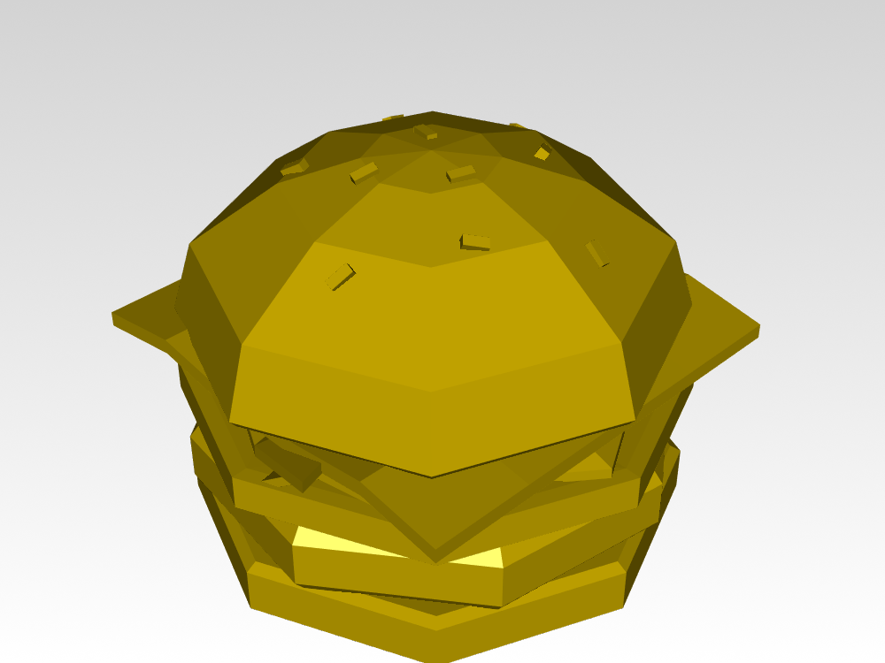
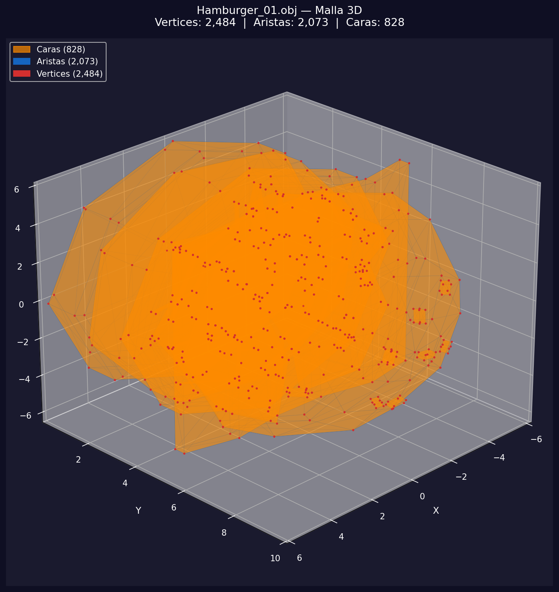
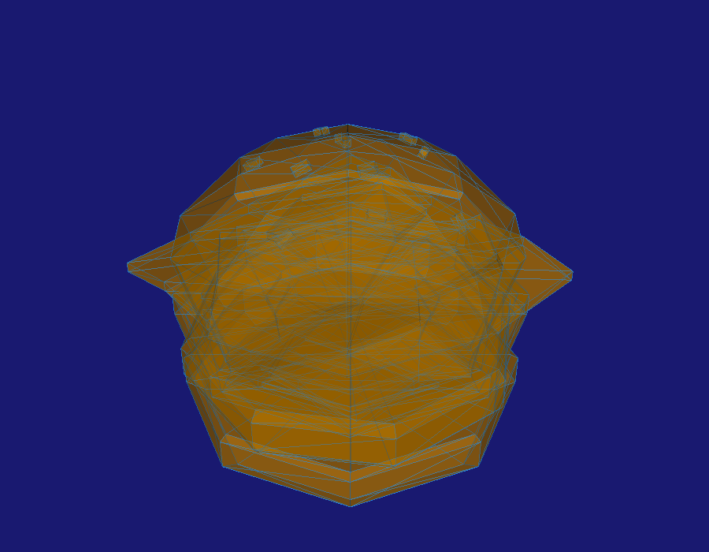
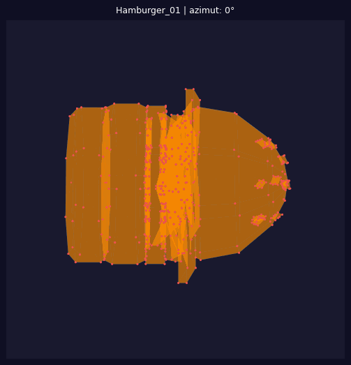
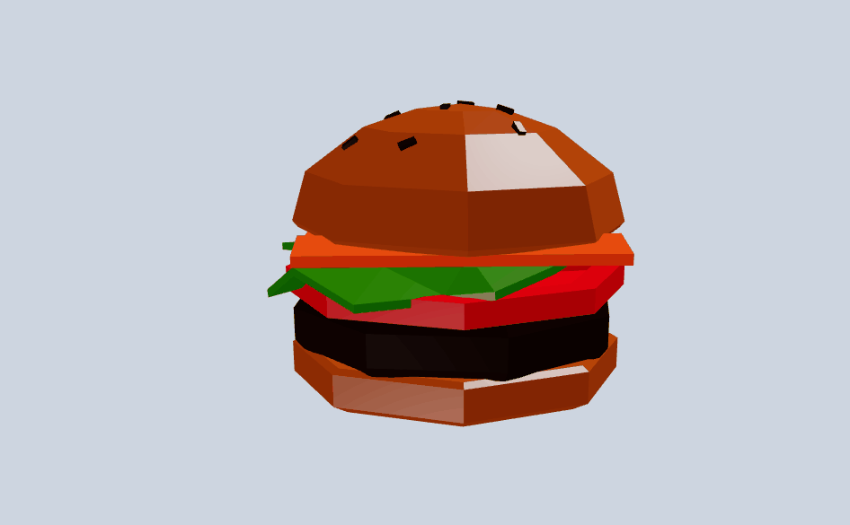

# Taller — Construyendo el Mundo 3D: Vértices, Aristas y Caras

**Nombre del estudiante:** Juan David Cardenas Galvis  
**Fecha de entrega:** 2025-02-20

---

## Descripción breve

El objetivo de este taller fue comprender las estructuras gráficas fundamentales que componen los modelos 3D: vértices, aristas y caras. Se trabajó con el modelo `Hamburger_01.obj` como objeto de estudio, explorando su geometría desde dos entornos distintos: Python (Jupyter Notebook) y Three.js con React Three Fiber.

En Python se analizó la malla de forma programática usando `trimesh` y se generaron visualizaciones estáticas con `matplotlib` y `vedo`, diferenciando cada componente geométrico por color. También se extrajeron métricas estructurales del modelo (recuento de vértices, aristas y caras, bounding box, área, característica de Euler) y se exportó una animación GIF con la malla rotando 360°.

En Three.js se construyó una aplicación interactiva con React Three Fiber que permite cambiar en tiempo real entre los tres modos de visualización (vértices, aristas, caras) con un panel lateral que muestra las estadísticas del modelo y un overlay semitransparente para dar contexto espacial en los modos de estructura.

---

## Implementaciones

### Python

Se desarrolló un Jupyter Notebook que carga el modelo `.OBJ` con `trimesh` y con `vedo`. El notebook está organizado en seis secciones:

1. Instalación e importación de librerías (`trimesh`, `vedo`, `numpy`, `matplotlib`, `imageio`).
2. Carga del modelo con ambas librerías y unificación de submallas.
3. Extracción de información estructural: número de vértices, aristas únicas, caras, bounding box, área superficial y característica de Euler $(V - E + F)$.
4. Visualización 3D con `matplotlib` sobre fondo oscuro, usando `Poly3DCollection` para las caras (naranja), líneas para las aristas (azul) y scatter para los vértices (rojo). Se aplica submuestreo automático para modelos densos.
5. Visualización interactiva *offscreen* con `vedo`, separando los tres componentes en objetos distintos.
6. Generación de una animación GIF de 60 frames (rotación 360° en el eje Y) exportada con `imageio.v3`.

**Herramientas:** `trimesh`, `vedo`, `numpy`, `matplotlib` (mpl_toolkits.mplot3d), `imageio`

### Three.js / React Three Fiber

Se construyó una SPA con **Vite + React 19 + Three.js 0.183** usando `@react-three/fiber` y `@react-three/drei`. La aplicación carga el modelo `Hamburger_01.obj` con `OBJLoader` y sus materiales con `MTLLoader`.

Un panel lateral permite cambiar entre tres modos de visualización:

- **Caras** — renderizado completo con materiales MTL y sombreado Phong.
- **Aristas** — `EdgesGeometry` con `lineBasicMaterial` sobre un mesh fantasma semitransparente para mantener el contexto de forma.
- **Vértices** — `Points` con `pointsMaterial` (tamaño fijo en píxeles) igualmente sobre el ghost mesh.

El panel también muestra en tiempo real el número de vértices, caras y aristas del modelo, calculados al montar el componente. Se incluyen `OrbitControls` para navegación libre (orbitar, zoom, desplazar).

**Herramientas:** React 19, Three.js, @react-three/fiber, @react-three/drei, Vite

---

## Resultados visuales

### Python — Implementación

  
*Render del archivo MTL, usando vedo con sombreado glossy y normales suaves (Phong).*

  
*Malla completa sobre fondo oscuro en matplotlib: caras en naranja, aristas en azul y vértices en rojo. Aplica submuestreo para rendimiento.*

  
*Renderizado offscreen con vedo mostrando los tres componentes geométricos simultáneamente.*

  
*Animación de 60 frames a 18 fps: la malla gira 360° alrededor del eje Y generada con imageio.*

### Three.js — Implementación

  
*Visor 3D con panel lateral: alternar entre modos de visualización y consultar estadísticas del modelo en tiempo real.*

  
*Modo vértices con ghost mesh semitransparente y OrbitControls para navegación libre.*

---

## Código relevante

### Python — Carga y métricas estructurales con Trimesh

```python
import trimesh
import numpy as np

loaded = trimesh.load("Hamburger_01.obj", force="mesh")

if isinstance(loaded, trimesh.Scene):
    geometries = list(loaded.geometry.values())
    mesh = trimesh.util.concatenate(geometries)

n_vertices = mesh.faces.shape[0] * 3
n_edges    = len(mesh.edges_unique)
n_faces    = mesh.faces.shape[0]

print(f"Vertices : {n_vertices:,}")
print(f"Aristas  : {n_edges:,}")
print(f"Caras    : {n_faces:,}")
print(f"Euler (V - E + F) = {mesh.vertices.shape[0] - n_edges + n_faces}")
```

### Python — Visualización con Matplotlib (caras + aristas + vértices)

```python
from mpl_toolkits.mplot3d.art3d import Poly3DCollection
import matplotlib.pyplot as plt

fig = plt.figure(figsize=(14, 10))
ax  = fig.add_subplot(111, projection="3d")

# Caras
tri_coords = verts[faces_draw]
ax.add_collection3d(Poly3DCollection(tri_coords, alpha=0.35,
                                      facecolor="#FF8C00", edgecolor="none"))
# Aristas
for e in edges_draw:
    p1, p2 = verts[e[0]], verts[e[1]]
    ax.plot([p1[0], p2[0]], [p1[1], p2[1]], [p1[2], p2[2]],
            color="#1565C0", linewidth=0.3, alpha=0.6)

# Vértices
ax.scatter(verts_draw[:, 0], verts_draw[:, 1], verts_draw[:, 2],
           color="#D32F2F", s=2, alpha=0.8)
```

### Python — Exportar GIF rotacional

```python
import imageio.v3 as iio
import io

frames = []
for azim in range(0, 360, 6):
    fig_anim = plt.figure(figsize=(9, 7), facecolor="#0f0f23")
    ax_anim  = fig_anim.add_subplot(111, projection="3d", facecolor="#1a1a2e")
    # ... renderizado de la malla ...
    ax_anim.view_init(elev=20, azim=azim)
    buf = io.BytesIO()
    fig_anim.savefig(buf, format="png", dpi=90, bbox_inches="tight")
    buf.seek(0)
    frames.append(iio.imread(buf))
    plt.close(fig_anim)

iio.imwrite("hamburguer_rotation.gif", frames, extension=".gif",
            duration=int(1000 / 18), loop=0)
```

### Three.js — Componente Model con modos de visualización

```jsx
import { useLoader } from "@react-three/fiber"
import { OBJLoader } from "three/examples/jsm/loaders/OBJLoader"
import { MTLLoader } from "three/examples/jsm/loaders/MTLLoader"
import { EdgesGeometry } from "three"

function Model({ mode, onStats }) {
  const mtl = useLoader(MTLLoader, "/models/Hamburger_01.mtl")
  const obj = useLoader(OBJLoader, "/models/Hamburger_01.obj", (loader) => {
    mtl.preload()
    loader.setMaterials(mtl)
  })

  // Ghost mesh para contexto en modos estructura
  const ghostFill = meshChildren.map((mesh) => (
    <mesh key={mesh.uuid + "_ghost"} geometry={mesh.geometry}>
      <meshPhongMaterial color="#c8d4e8" transparent opacity={0.18}
                         depthWrite={false} side={2} />
    </mesh>
  ))

  if (mode === "aristas") {
    return (
      <group>
        {ghostFill}
        {meshChildren.map((mesh) => (
          <lineSegments key={mesh.uuid}>
            <edgesGeometry args={[mesh.geometry]} />
            <lineBasicMaterial color="#1b2d4f" transparent opacity={0.85} />
          </lineSegments>
        ))}
      </group>
    )
  }
  // ...
}
```

### Three.js — Cálculo de estadísticas del modelo

```jsx
useEffect(() => {
  let vertices = 0, faces = 0, edges = 0
  meshChildren.forEach((m) => {
    const pos = m.geometry.attributes.position
    if (pos) vertices += pos.count
    if (m.geometry.index) faces += m.geometry.index.count / 3
    else if (pos) faces += pos.count / 3
    const edgesGeo = new EdgesGeometry(m.geometry)
    edges += edgesGeo.attributes.position.count / 2
    edgesGeo.dispose()
  })
  onStats({ vertices, faces: Math.round(faces), edges: Math.round(edges) })
}, [meshChildren, onStats])
```

---

## Prompts utilizados

- *"Ayudame a extraer la información estructural (vértices, aristas, caras) del archivo .obj"*
- *"Como genero una animación GIF rotacional de una malla 3D en Python usando matplotlib y imageio, iterando el azimut de 0° a 360°."*
- *"Implementa un ghost mesh semitransparente en React Three Fiber para mantener el contexto de forma del modelo cuando se visualizan solo vértices o aristas."*

---

## Aprendizajes y dificultades

### Aprendizajes

Este taller consolidó la comprensión de las tres primitivas geométricas de toda malla poligonal: vértice (punto XYZ), arista (segmento entre dos vértices) y cara (polígono cerrado por tres o más vértices). Trabajar con `trimesh` demostró cómo estas estructuras se representan como arrays NumPy (`mesh.vertices`, `mesh.faces`, `mesh.edges_unique`), lo que conecta directamente la geometría 3D con el álgebra lineal. En Three.js quedó claro que `BufferGeometry` almacena posiciones, índices y atributos de forma análoga, y que `EdgesGeometry` calcula automáticamente las aristas únicas a partir de las caras.

### Dificultades

La mayor complejidad en Python estuvo en el rendimiento: el modelo Hamburger_01 es suficientemente denso como para que un render sin submuestreo congele matplotlib. La solución fue aplicar `np.random.choice` para seleccionar subconjuntos representativos de caras, aristas y vértices antes de dibujar. En Three.js el desafío fue mantener el contexto visual en los modos de estructura pura; los vértices y aristas solos resultaban difíciles de interpretar sin referencia de forma, lo que llevó a incorporar el ghost mesh semitransparente.

### Mejoras futuras

En Three.js se podría añadir color por cara según su normal (visualización de normales) o permitir aislar submallas individuales del modelo. También sería interesante exportar las estadísticas del modelo como JSON para compararlas con las obtenidas desde Python y validar la consistencia entre ambas herramientas.

---

## Estructura del proyecto

```
semana_1_1_construyendo_mundo_3d/
├── python/
│   ├── visualizacion_3d_hamburger.ipynb
│   ├── Hamburger_01.mtl
│   └── Hamburger_01.mtl.bak
├── threejs/
│   └── mundo3D/
│       ├── src/
│       │   ├── App.jsx
│       │   ├── App.css
│       │   └── main.jsx
│       ├── public/
│       │   └── models/
│       │       └── Hamburger_01.mtl
│       ├── package.json
│       ├── vite.config.js
│       └── index.html
├── media/
│   ├── python_hamburger.png
│   ├── python_hamburger_mesh_visualizacion.png
│   ├── python_hamburger_vedo_visualizacion.png
│   ├── python_hamburguer_rotation.gif
│   ├── animation_threejs.gif
│   └── animation_threejs2.gif
└── README.md
```
