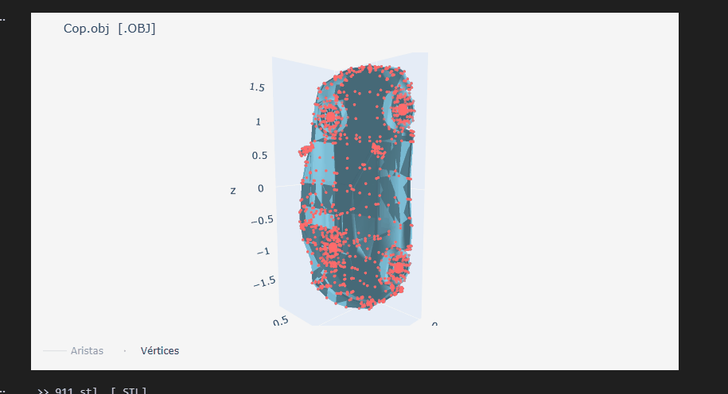

# Taller — Conversión de Formatos 3D

## Nombre del estudiante

Juan David Cárdenas Galvis

## Fecha de entrega

`2026-02-21`

---

## Descripción breve

El objetivo del taller fue explorar la estructura interna de los principales formatos de modelos 3D (`.OBJ`, `.STL`, `.GLTF`), comparar sus propiedades geométricas y realizar conversiones entre ellos.

Se implementaron dos entornos: un notebook de Python para análisis, conversión y visualización estadística de los modelos, y una aplicación web con Three.js/React Three Fiber para visualización interactiva en tiempo real.

Los modelos utilizados son: **Police Car** (`Cop.obj`), **Porsche 911** (`911.stl`) y **Mazda RX-7 Stylised** (`mazda_rx7.gltf`).

---

## Implementaciones

### Python

Se utilizó `trimesh` para cargar los tres modelos, analizar sus propiedades (vértices, caras, normales, vértices duplicados, materiales) y realizar conversiones entre formatos. La visualización se realizó con `plotly` (gráficas 3D interactivas con malla, wireframe y nube de vértices), reemplazando `open3d` que no tiene soporte para Python 3.14.

Como bonus se implementó un script de comparación masiva (`reporte_masivo`) que recorre toda la carpeta `media/` y genera una tabla comparativa de todos los modelos presentes.

**Dependencias:** `trimesh`, `plotly`, `numpy`, `scipy`, `nbformat`

### Three.js / React Three Fiber

Se construyó una SPA con Vite + React que carga los tres modelos simultáneamente y permite alternar entre ellos mediante un panel lateral. Cada modelo se normaliza automáticamente (escala y centrado). Se añaden overlays de aristas y vértices sobre cada malla para visualizar la geometría.

**Componentes:** `ModelLoader` (carga con `OBJLoader`+`MTLLoader`, `STLLoader`, `GLTFLoader`), `Scene` (iluminación, grilla infinita, fog), `UIControls` (selector de formato + estadísticas de geometría).

**Bonus:** Se muestra en tiempo real el número de vértices, caras y formato activo en el panel lateral.

---

## Resultados visuales

### Python — Análisis y visualización


Vista 3D interactiva de los modelos con malla sólida, wireframe de aristas y nube de vértices generada con Plotly.



Análisis estadístico de geometría y tabla comparativa de modelos originales y convertidos.

### Three.js — Visor interactivo


Alternancia entre los tres formatos (OBJ, STL, GLTF) con overlays de aristas y vértices en tiempo real.


Exploración orbital del modelo con OrbitControls. Panel lateral muestra vértices, caras y formato activo.

---

## Código relevante

### Carga y análisis de modelo (Python)

```python
def cargar_modelo(archivo: Path) -> Dict[str, Any]:
    objeto = trimesh.load(archivo, process=False, maintain_order=True)
    if isinstance(objeto, trimesh.Scene):
        malla_base = _fusionar_geometrias(objeto)
        origen = 'scene'
    elif isinstance(objeto, trimesh.Trimesh):
        malla_base = objeto
        origen = 'mesh'
    return {'ruta': Path(archivo), 'objeto_cargado': objeto, 'malla': malla_base, 'tipo_carga': origen}
```

### Conversión entre formatos (Python)

```python
def exportar_modelo(modelo, ext_destino, carpetas, motor='trimesh'):
    for carpeta in carpetas:
        destino = carpeta / f'{modelo["ruta"].stem}_converted.{ext_destino}'
        trimesh.exchange.export.export_mesh(modelo['malla'], str(destino), file_type=ext_destino)
    return rutas_generadas
```

### Carga de modelos en Three.js

```jsx
const materiales = useLoader(MTLLoader, RUTAS.OBJ_MTL)
const objRaw = useLoader(OBJLoader, RUTAS.OBJ, (loader) => {
  materiales.preload()
  loader.setMaterials(materiales)
})
const stlGeo  = useLoader(STLLoader,  RUTAS.STL)
const gltf    = useLoader(GLTFLoader, RUTAS.GLTF)
```

### Normalización y overlays (Three.js)

```javascript
export function normalizeObject3D(objeto, tamanoObjetivo = 2.6) {
  const caja   = new THREE.Box3().setFromObject(objeto)
  const tamaño = caja.getSize(new THREE.Vector3())
  const centro = caja.getCenter(new THREE.Vector3())
  const ejeMax = Math.max(tamaño.x, tamaño.y, tamaño.z)
  if (ejeMax > 0) objeto.scale.multiplyScalar(tamanoObjetivo / ejeMax)
  objeto.position.sub(centro.multiplyScalar(objeto.scale.x))
  configurarSombras(objeto)
  return objeto
}
```

---

## Prompts utilizados

```
"Corrige el error ModuleNotFoundError: No module named 'open3d'"

"Haz que la interfaz se vea agradable y funcional. El .obj está inclinado 90°, haz que quede bien también"
```

---

## Aprendizajes y dificultades

### Aprendizajes

Quedó claro que cada formato 3D tiene un propósito distinto: `.STL` es simple y sin materiales (ideal para impresión 3D), `.OBJ` soporta materiales vía MTL, y `.GLTF` es el más completo al incluir geometría, materiales y animaciones en un solo archivo. Las conversiones entre formatos no siempre son sin pérdida — convertir de GLTF a STL, por ejemplo, puede generar vértices adicionales al triangular la malla.

### Dificultades

`open3d` no tiene soporte para Python 3.14, lo que obligó a migrar toda la visualización a `plotly`. Además, `three-mesh-bvh` requería archivos generados en postinstall que faltaban por una instalación corrupta, resuelto con reinstalación limpia de `node_modules`. La orientación del modelo OBJ requirió entender el sistema de coordenadas de Blender (Y‑up) vs. el esperado por Three.js.

### Mejoras futuras

Implementar un modo de comparación lado a lado (split view) para los tres formatos simultáneamente, y agregar métricas adicionales como el tamaño en disco de cada archivo y tiempo de carga.

---

## Estructura del proyecto

```
semana_1_2_conversion_formatos_3d/
├── python/
│   └── Taller_Importando_el_Mundo_Visualizacion_y_Conversion_de_Formatos_3D.ipynb
├── threejs/
│   ├── src/
│   │   ├── components/   # ModelLoader, Scene, UIControls
│   │   └── utils/        # modelUtils.js
│   └── public/           # Cop.obj, 911.stl, mazda_rx7.gltf
├── media/
│   ├── police_car/       # Cop.obj + Cop.mtl
│   ├── porsche_911/      # 911.stl
│   ├── mazda_rx7/        # scene.gltf + scene.bin
│   └── converted/        # Archivos generados por el notebook
└── README.md
```
