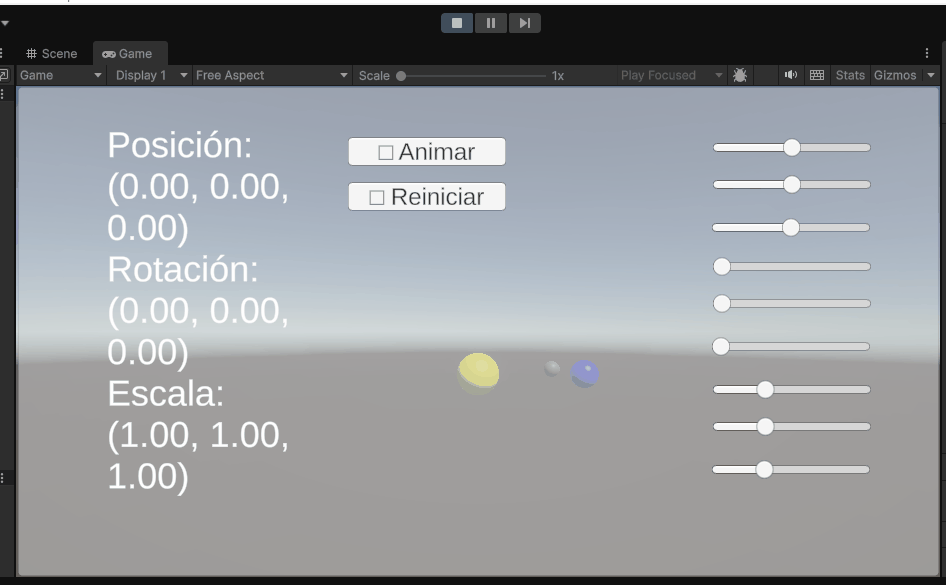
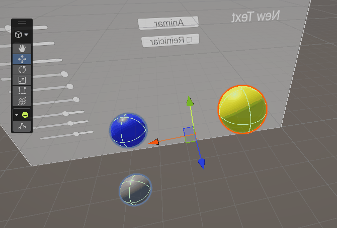

# Taller — Jerarquías y Transformaciones

## Nombre del estudiante

Juan David Cardenas Galvis

## Fecha de entrega

`2026-02-20`

---

## Descripción breve

Este taller tuvo como objetivo explorar los conceptos fundamentales de las transformaciones geométricas —traslación, rotación y escala— y las estructuras jerárquicas padre-hijo en distintos entornos de programación visual. Se buscaba comprender cómo las transformaciones aplicadas a un nodo padre se propagan automáticamente a todos sus nodos hijos y nietos, simulando comportamientos de movimiento relativo entre objetos.

En **Unity**, se construyó una escena 3D con una jerarquía de tres objetos anidados (padre → hijo → nieto) representando un sistema planetario. Se desarrolló un script en C# que permite controlar en tiempo real la posición, rotación y escala del objeto padre mediante nueve sliders de UI, observando en vivo cómo los objetos hijos heredan todas las transformaciones aplicadas. Como bonus se implementó una animación automática de rotación en los tres ejes con botones de pausa y reinicio.

En **Three.js con React Three Fiber**, se construyó un sistema solar interactivo con tres niveles jerárquicos: Sol (padre) → Tierra y Saturno (hijos) → Luna (nieta, hija de Tierra). Se utilizó `leva` para exponer sliders de rotación, traslación del nodo raíz y velocidades de órbita individuales, permitiendo observar en tiempo real cómo las transformaciones del padre afectan a toda la jerarquía.

---

## Implementaciones

### Unity

Se implementó una escena 3D en Unity con una jerarquía de tres objetos anidados que representan un sistema planetario (Sol → Tierra → Luna). El script `ControladorJerarquia.cs` se conecta a un Canvas que contiene:

- **9 sliders** agrupados en Posición (X, Y, Z), Rotación (X, Y, Z) y Escala (X, Y, Z).
- **Un campo de texto** (TextMeshPro) que muestra los valores actuales de posición, rotación y escala del padre en tiempo real.
- **Dos botones**: uno para activar/pausar la animación automática y otro para reiniciar al estado inicial.

Cuando la animación está activa, el padre rota en los tres ejes y los sliders de rotación se actualizan solos. Los sliders de posición y escala permanecen disponibles durante la animación.

### Three.js / React Three Fiber

Se implementó un sistema solar jerárquico con **Vite + React Three Fiber** (carpeta `threejs/sistemaSolar`). La jerarquía cuenta con tres niveles:

- **Nivel 1 — Sol (nodo padre):** contiene toda la escena; su rotación y traslación se controlan con sliders de `leva`.
- **Nivel 2 — Tierra y Saturno (hijos del Sol):** orbitan el Sol con radios y velocidades independientes, cargados como modelos `.glb` con `useGLTF`.
- **Nivel 3 — Luna (nieta, hija de la Tierra):** orbita la Tierra con su propio radio y velocidad, formando la cadena de tres niveles.

El panel de `leva` expone tres grupos de controles: transformaciones del nodo padre (rotación XYZ y traslación XYZ), tamaños individuales de cada cuerpo y velocidades de órbita. La escena incluye un fondo estrellado (`Stars`) y `OrbitControls` para navegación libre con el ratón.

---

## Resultados visuales

### Unity — Implementación


*Sliders de posición, rotación y escala moviendo el objeto padre; los hijos heredan las transformaciones en tiempo real.*


*Animación automática rotando el padre en los tres ejes con los sliders de rotación actualizándose en tiempo real.*

### Three.js — Implementación


*Sistema solar con tres niveles de jerarquía; los controles del nodo padre (Sol) afectan la posición y orientación de toda la escena.*


*Panel de leva mostrando control de tamaños y velocidades de órbita individuales para Tierra, Saturno y Luna.*

---

## Código relevante

### Unity — Script principal `ControladorJerarquia.cs`

```csharp
using UnityEngine;
using UnityEngine.UI;
using TMPro;

public class ControladorJerarquia : MonoBehaviour
{
    [Header("Objeto Padre")]
    public Transform padre;

    [Header("Sliders de Posición")]
    public Slider sliderPosX, sliderPosY, sliderPosZ;

    [Header("Sliders de Rotación")]
    public Slider sliderRotX, sliderRotY, sliderRotZ;

    [Header("Sliders de Escala")]
    public Slider sliderEscX, sliderEscY, sliderEscZ;

    [Header("UI Info")]
    public TMP_Text textInfo;

    [Header("Bonus - Animación")]
    public Button btnAnimar;
    public Button btnReiniciar;

    private bool animando = false;
    private Vector3 posicionInicial;
    private Quaternion rotacionInicial;
    private Vector3 escalaInicial;

    void Start()
    {
        posicionInicial = padre.position;
        rotacionInicial = padre.rotation;
        escalaInicial   = padre.localScale;

        btnAnimar.onClick.AddListener(ToggleAnimacion);
        btnReiniciar.onClick.AddListener(Reiniciar);
    }

    void Update()
    {
        if (!animando)
        {
            padre.position   = new Vector3(sliderPosX.value, sliderPosY.value, sliderPosZ.value);
            padre.rotation   = Quaternion.Euler(sliderRotX.value, sliderRotY.value, sliderRotZ.value);
            padre.localScale = new Vector3(sliderEscX.value, sliderEscY.value, sliderEscZ.value);
        }
        else
        {
            padre.Rotate(50f * Time.deltaTime, 50f * Time.deltaTime, 50f * Time.deltaTime);
            sliderRotX.value = padre.eulerAngles.x;
            sliderRotY.value = padre.eulerAngles.y;
            sliderRotZ.value = padre.eulerAngles.z;
        }

        textInfo.text =
            $"Posición:  {padre.position}\n" +
            $"Rotación:  {padre.eulerAngles}\n" +
            $"Escala:    {padre.localScale}";
    }

    void ToggleAnimacion()
    {
        animando = !animando;
        btnAnimar.GetComponentInChildren<TMP_Text>().text = animando ? "⏸ Pausar" : "▶ Animar";
    }

    void Reiniciar()
    {
        animando = false;
        padre.position   = posicionInicial;
        padre.rotation   = rotacionInicial;
        padre.localScale = escalaInicial;

        sliderPosX.value = 0; sliderPosY.value = 0; sliderPosZ.value = 0;
        sliderRotX.value = 0; sliderRotY.value = 0; sliderRotZ.value = 0;
        sliderEscX.value = 1; sliderEscY.value = 1; sliderEscZ.value = 1;

        btnAnimar.GetComponentInChildren<TMP_Text>().text = "▶ Animar";
    }
}
```

### Three.js — Nodo padre y jerarquía (`App.jsx`)

```jsx
// NIVEL 1 – Nodo Padre: Sol
function SolarSystem() {
  const { 'Rotación X': rotX, 'Rotación Y': rotY, 'Rotación Z': rotZ,
          'Traslación X': posX, 'Traslación Y': posY, 'Traslación Z': posZ }
    = useControls('🌞 Nodo Padre — Sol', {
        'Rotación X':   { value: 0, min: -Math.PI, max: Math.PI, step: 0.01 },
        'Rotación Y':   { value: 0, min: -Math.PI, max: Math.PI, step: 0.01 },
        'Rotación Z':   { value: 0, min: -Math.PI, max: Math.PI, step: 0.01 },
        'Traslación X': { value: 0, min: -20, max: 20, step: 0.1 },
        'Traslación Y': { value: 0, min: -20, max: 20, step: 0.1 },
        'Traslación Z': { value: 0, min: -20, max: 20, step: 0.1 },
      })

  return (
    <group rotation={[rotX, rotY, rotZ]} position={[posX, posY, posZ]}>
      {/* NIVEL 1 */}
      <SunModel scale={sunScale} />
      {/* NIVEL 2 + NIVEL 3 */}
      <EarthOrbit speed={earthSpeed} moonSpeed={moonSpeed}
                  sunScale={sunScale} earthScale={earthScale} moonScale={moonScale} />
      <SaturnOrbit speed={saturnSpeed} sunScale={sunScale} saturnScale={saturnScale} />
    </group>
  )
}
```

```jsx
// NIVEL 3 – Luna orbita alrededor de la Tierra
function MoonOrbit({ speed, moonScale }) {
  const groupRef = useRef()
  const angle = useRef(0)
  const orbitRadius = 12

  useFrame((_, delta) => {
    angle.current += delta * speed
    if (groupRef.current) {
      groupRef.current.position.x = Math.cos(angle.current) * orbitRadius
      groupRef.current.position.z = Math.sin(angle.current) * orbitRadius
    }
  })

  return (
    <group ref={groupRef}>
      <MoonModel scale={moonScale} />
    </group>
  )
}
```

---

## Prompts utilizados

```
"Crea un script en C# para Unity que controle las transformaciones de un objeto padre
con sliders de UI y muestre los valores en pantalla"

"Quiero que cuando active la animación, los sliders de rotación se muevan solos
reflejando los valores reales del objeto padre"

"Los radios de órbita de la Tierra y Saturno deben depender del tamaño del Sol,
no del tamaño de los planetas, para que los sliders de tamaño no rompan las órbitas"
```

---

## Aprendizajes y dificultades

### Aprendizajes

A través de este taller quedó muy claro que cualquier transformación aplicada al nodo padre —traslación, rotación o escala— se propaga automáticamente a todos los hijos y nietos sin modificarlos directamente, tanto en Unity como en React Three Fiber con el componente `<group>`. Este principio es fundamental para construir personajes articulados, sistemas planetarios y cualquier objeto compuesto. También se reforzó el uso de la UI de Unity (Canvas, Sliders, Buttons y TextMeshPro) y de `leva` en React para crear paneles de control interactivos que comunican valores en tiempo real.

### Dificultades

La parte más desafiante en Unity fue sincronizar la dirección del flujo de información entre los sliders y el objeto: cuando la animación está activa el objeto debe actualizar los sliders, y cuando está inactiva los sliders deben controlar al objeto. Se resolvió separando ambos estados con un booleano `animando` dentro del `Update()`. En React Three Fiber, el reto fue que los radios de órbita de los planetas dependían de su propio tamaño, lo que hacía que al escalar un planeta las órbitas se solaparan; se corrigió calculando los radios únicamente en función del tamaño del Sol.

### Mejoras futuras

En proyectos futuros se podría extender el sistema Unity para controlar individualmente las transformaciones de cada hijo y nieto, simulando la rotación de planetas sobre su propio eje mientras orbitan. En Three.js sería interesante añadir un cuarto nivel (lunas adicionales o anillos de Saturno como grupos hijos), incorporar curvas de animación para movimientos más naturales y agregar un modo de "pausa" al sistema orbital directamente desde el panel de `leva`.

---

## Estructura del proyecto

```
semana_1_3_jerarquias_transformaciones/
├── unity/                  # Proyecto Unity con jerarquía 3D y script C#
├── threejs/
│   └── sistemaSolar/       # Proyecto Vite + React Three Fiber
│       ├── src/
│       │   └── App.jsx     # Componente principal con la jerarquía
│       ├── public/
│       │   └── models/     # Modelos GLB (sol, tierra, saturno, luna)
│       └── package.json
├── media/                  # GIFs y capturas de resultados
│   ├── animation_unity.gif
│   ├── animation_unity2.gif
│   ├── threejs1.gif
│   └── threejs2.gif
└── README.md
```

