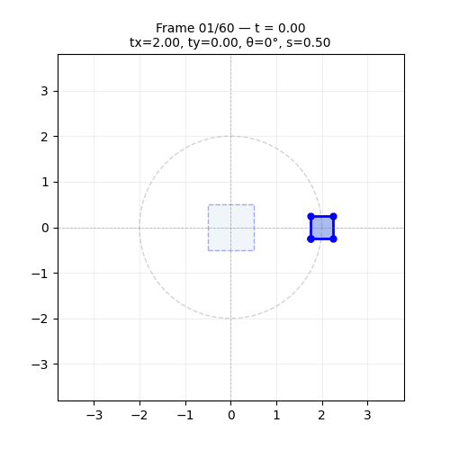
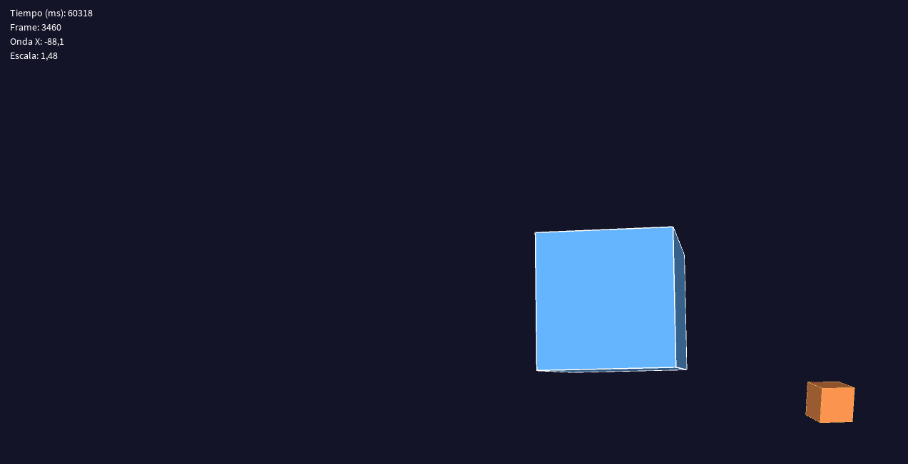

# Taller — Transformaciones Básicas en Computación Visual

## Nombre del estudiante

Juan David Cárdenas Galvis

## Fecha de entrega

2026-02-21

---

## Descripción breve

Este taller explora los tres pilares de las **transformaciones geométricas**: traslación, rotación y escala. El objetivo es construir un "Hola Mundo Visual" en el que un objeto básico sea sometido a dichas transformaciones tanto de forma estática como animada en función del tiempo, implementando las mismas ideas en tres entornos distintos de programación gráfica.

Se desarrollaron implementaciones en **Python** (Jupyter Notebook), **Three.js con React Three Fiber** y **Processing (3D)**. En cada caso se utilizaron las primitivas propias del entorno para expresar las matrices de transformación y se animaron los parámetros mediante funciones periódicas como `sin`, `cos` y `frameCount`.

El resultado es un conjunto de animaciones que muestran a un cuadrado (2D) o a un cubo (3D) siguiendo trayectorias circulares/senoidales, rotando sobre sus ejes y pulsando en tamaño, todo compuesto en una única transformación por frame.

---

## Implementaciones

### Python

Se implementó un notebook de Jupyter que representa un **cuadrado unitario en coordenadas homogéneas** (matriz 3×5). Las tres transformaciones se codifican como matrices 3×3 y se componen mediante multiplicación de matrices (`M = T · R · S`). Se generaron 60 fotogramas en los que el parámetro `t ∈ [0, 1]` controla:

- **Traslación**: órbita circular `(2cos(2πt), 2sin(2πt))`
- **Rotación**: vuelta completa `θ = 2πt`
- **Escala**: pulso `s = 0.5 + sin²(πt)` ∈ [0.5, 1.5]

Los frames se capturan con `matplotlib` + `FigureCanvasAgg` y se exportan como GIF con `imageio`.

**Herramientas:** `numpy`, `matplotlib`, `imageio`

### Three.js / React Three Fiber

Se creó un proyecto con **Vite + React** que renderiza una escena 3D interactiva. El componente `AnimatedCube` utiliza el hook `useFrame` para actualizar en cada frame:

- **Traslación**: trayectoria circular en XY y senoidal en Z usando `Math.cos` / `Math.sin`
- **Rotación**: incremento continuo sobre los tres ejes
- **Escala**: pulso `s = 1 + 0.4·sin(t·2)` oscilando entre 0.6 y 1.4

La escena incluye una esfera estática de referencia, una grilla, estrellas de fondo y `OrbitControls` para navegar con el ratón.

**Herramientas:** `@react-three/fiber`, `@react-three/drei`, `Vite`, `React`

### Processing

Se implementó un **sketch 3D** (`P3D`) con dos cubos:

- **Cubo principal**: traslación ondulatoria con `sin(millis())`, rotación simultánea en los tres ejes con `frameCount`, y escala cíclica con `sin(millis())`.
- **Cubo satélite**: órbita circular alrededor del origen usando `sin/cos`.

Se usa `pushMatrix()` / `popMatrix()` para aislar las transformaciones de cada objeto, y se muestra en pantalla el tiempo, el frame actual y los valores numéricos de onda y escala en tiempo real.

**Herramientas:** Processing

---

## Resultados visuales

### Python — Implementación



GIF animado de 60 frames que muestra el cuadrado unitario siguiendo una órbita circular, rotando 360° y pulsando en tamaño conforme el parámetro `t` avanza de 0 a 1.


Comparativa estática de las cuatro transformaciones: traslación, rotación, escala y compuesta (T·R·S) sobre el cuadrado base.

### Three.js — Implementación


Vista de la escena 3D completa: el cubo morado sigue una trayectoria circular mientras rota y pulsa en tamaño. Se aprecia el fondo de estrellas y la grilla de referencia.


Demostración del bonus de navegación interactiva con `OrbitControls`: arrastre para orbitar y scroll para zoom.

### Processing — Implementación


Animación del cubo principal con traslación ondulatoria, rotación en tres ejes y escala cíclica, junto con el cubo satélite en órbita circular.



Captura de un frame del sketch procesado mostrando ambos cubos, la iluminación 3D y el HUD de valores en tiempo real.

---

## Código relevante

### Python — Matrices de transformación homogéneas

```python
import numpy as np

def T(tx, ty):
    return np.array([[1, 0, tx],
                     [0, 1, ty],
                     [0, 0,  1]], dtype=float)

def R(theta):
    c, s = np.cos(theta), np.sin(theta)
    return np.array([[ c, -s, 0],
                     [ s,  c, 0],
                     [ 0,  0, 1]], dtype=float)

def S(sx, sy):
    return np.array([[sx,  0, 0],
                     [ 0, sy, 0],
                     [ 0,  0, 1]], dtype=float)

# Transformación compuesta animada en función de t
t = i / N_FRAMES
M_t = T(2*np.cos(2*np.pi*t), 2*np.sin(2*np.pi*t)) \
      @ R(2*np.pi*t) \
      @ S(0.5 + np.sin(np.pi*t)**2, 0.5 + np.sin(np.pi*t)**2)
sq_anim = M_t @ square
```

### Three.js — Animación con `useFrame`

```jsx
useFrame(({ clock }) => {
  const t = clock.elapsedTime
  const radius = 2.5

  // Traslación circular
  meshRef.current.position.x = Math.cos(t * 0.8) * radius
  meshRef.current.position.y = Math.sin(t * 0.8) * radius
  meshRef.current.position.z = Math.sin(t * 1.2) * 1.2

  // Rotación continua
  meshRef.current.rotation.x += 0.012
  meshRef.current.rotation.y += 0.018

  // Escala pulsante
  const s = 1 + 0.4 * Math.sin(t * 2)
  meshRef.current.scale.set(s, s, s)
})
```

### Processing — Transformaciones con `pushMatrix` / `popMatrix`

```java
pushMatrix();
  float ondaX = sin(millis() * 0.001) * 150;
  float ondaY = cos(millis() * 0.001) * 80;
  translate(ondaX, ondaY, 0);

  rotateX(frameCount * 0.01);
  rotateY(frameCount * 0.02);
  rotateZ(frameCount * 0.005);

  float escala = 1.0 + sin(millis() * 0.002) * 0.5;
  scale(escala);

  fill(100, 180, 255);
  box(120);
popMatrix();
```

---

## Prompts utilizados

- "Ayudame a utilizar matrices homogéneas 3×3 con numpy y exporte el resultado como GIF con imageio"

---

## Aprendizajes y dificultades

### Aprendizajes

Este taller consolidó la comprensión de por qué las **coordenadas homogéneas** son fundamentales en computación visual: permiten representar traslación, rotación y escala como multiplicaciones de matrices, lo que hace posible componer cualquier número de transformaciones en una sola matriz `M = T · R · S`. Quedó muy claro que el **orden de las transformaciones importa** y que la convención habitual (primero escala, luego rotación, finalmente traslación) produce resultados intuitivos.

En Three.js, el hook `useFrame` del ecosistema React Three Fiber resultó muy util para expresar animaciones: basta con leer `clock.elapsedTime` y asignar directamente las propiedades del mesh en cada frame, sin necesidad de administrar un loop de renderizado manualmente.

### Dificultades

La principal dificultad en Python fue capturar los frames de `matplotlib` como arrays de numpy sin guardar archivos intermedios. La solución fue usar `FigureCanvasAgg` y `canvas.buffer_rgba()`, descartando el canal alpha antes de pasarlo a `imageio`. En Processing, el desafío fue coordinar `pushMatrix` / `popMatrix` correctamente para que las transformaciones del cubo satélite no afectaran al cubo principal.

### Mejoras futuras

Agregar un panel de control interactivo con `leva` en Three.js para modificar los parámetros en tiempo real, y explorar la representación con **matrices 4×4** en 3D para integrar la perspectiva en la misma cadena de transformaciones.


## Estructura del proyecto

```
semana1_4_transformaciones/
├── python/                  # Notebook Jupyter con transformaciones 2D
│   └── transformaciones_2D.ipynb
├── threejs/                 # Proyecto Vite + React Three Fiber
│   └── transformacionesthreejs/
├── proccesing/              # Sketch Processing 3D
│   └── sketch_260220a/
├── media/                   # Imágenes y GIFs de resultados
└── README.md
```