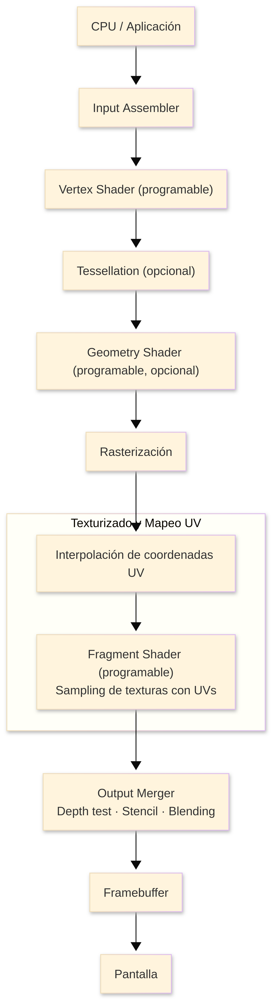
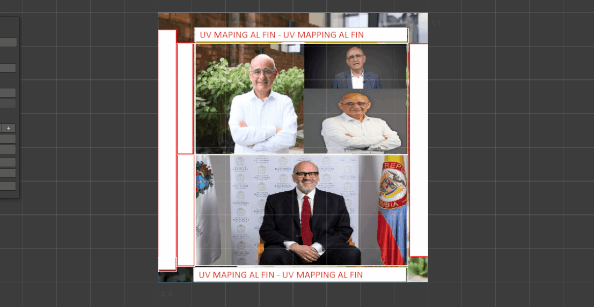
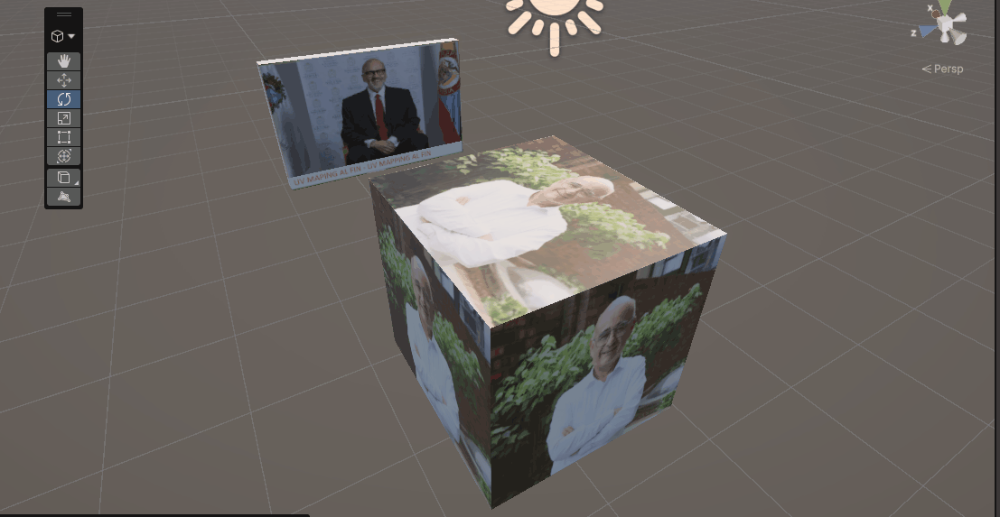
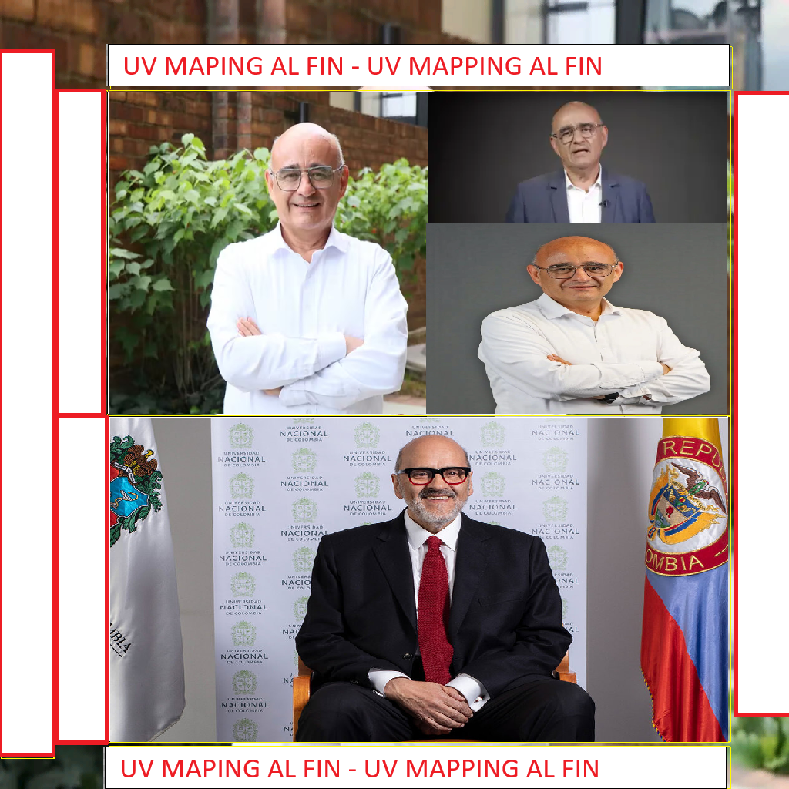

# Actividad S2_1 - Descomponiendo el Pipeline Gráfico

## Nombre de los estudiantes

- Juan David Buitrago Salazar
- Juan David Cardenas Galvis
- Camilo Andrés Medina Sánchez

## Fecha de entrega

`2026-02-18`

---

## Descripción breve

En esta actividad se trabajó el proceso de **UV Mapping** dentro de **Unity**, utilizando la herramienta **ProBuilder** para crear y editar geometría directamente en el editor.

El objetivo principal fue comprender cómo se despliegan (unwrap) las caras de un modelo 3D sobre un plano 2D para poder aplicar texturas de forma correcta, evitando distorsiones visibles y mejorando el resultado visual final.

Durante la práctica se realizaron ajustes de escala, rotación y organización de islas UV, verificando en tiempo real cómo estos cambios afectan la textura aplicada al objeto dentro de la escena.

---

## Temas abordados

**Tema 8: Texturizado y Mapeo UV**

- **Aplicación de imágenes sobre superficies 3D (texturizado):** una textura 2D se proyecta sobre un modelo 3D para darle color, detalle y apariencia de material sin aumentar mucho la geometría.
- **UV Mapping:** proceso de asignar coordenadas UV a cada vértice/cara del modelo para indicar qué parte de la imagen corresponde a cada zona de la malla.
- **Sampling:** operación con la que la GPU consulta el color de una textura usando coordenadas UV, convirtiendo esos datos en color final para cada fragmento.
- **Mipmaps:** versiones reducidas de la misma textura en varios niveles de resolución; se usan según la distancia/tamaño en pantalla para reducir aliasing y mejorar rendimiento.
- **Filtrado bilineal y trilineal:** el bilineal interpola entre texels vecinos para suavizar; el trilineal además interpola entre niveles mipmap para transiciones más limpias.
- **Wrapping de texturas:** define qué ocurre cuando las UV salen del rango $[0,1]$ (por ejemplo repetir, reflejar o clamp), controlando el comportamiento del patrón sobre la superficie.

> Nota: aunque estos conceptos se revisaron en la actividad, la práctica implementada en clase se centró únicamente en **UV Mapping**.

---

## Diagrama del pipeline (Mermaid)



---

## Implementación

### Unity + ProBuilder

Se construyeron objetos base con ProBuilder y se accedió al editor de UVs para:

- Generar el mapeo UV inicial del modelo.
- Separar y reorganizar islas UV según la forma del objeto.
- Corregir estiramientos o compresiones de textura.
- Ajustar tiling/escala para mantener proporciones visuales consistentes.

El resultado fue una escena con modelos correctamente mapeados y texturizados, demostrando el flujo básico de trabajo para UV mapping en Unity.

---

## Resultados visuales

### GIF 1 - Proceso de UV Mapping en ProBuilder



Demostración del flujo de trabajo en el editor de UVs de ProBuilder: generación del unwrap inicial, separación de islas UV y corrección de estiramientos.

### GIF 2 - Modelo texturizado en escena



Resultado final del objeto en Unity luego de ajustar correctamente el mapeo UV, mostrando la textura aplicada sin distorsiones visibles.

### UV Map del modelo de ejemplo



Vista del UV map desplegado en el espacio 2D, mostrando la distribución de las islas UV sobre el plano de coordenadas $[0,1]$.

---

## Prompts utilizados

Se utilizaron prompts de IA para apoyar la construcción de diapositivas y aterrizar conceptos del pipeline gráfico en Unity.

### Prompts para NotebookLM (diapositivas y síntesis teórica)

- "A partir de este material, crea una estructura de diapositivas (máximo 15) para explicar el pipeline gráfico de forma progresiva: entrada de geometría, shaders, rasterización, texturizado y salida a pantalla."
- "Resume en lenguaje académico pero claro la diferencia entre UV Mapping, Sampling, Mipmaps y Wrapping. Incluye una definición corta y un ejemplo práctico por concepto."
- "Genera una narrativa para exposición de 5 minutos sobre cómo una textura 2D termina viéndose en un objeto 3D dentro de Unity."
- "Propón 3 analogías didácticas para explicar coordenadas UV a estudiantes que están empezando en gráficos por computador."
- "Construye una tabla comparativa entre filtrado bilineal y trilineal con enfoque en calidad visual, costo de procesamiento y casos de uso."

### Prompts para apoyo en Unity (aterrizar conceptos a práctica)

- "Explícame paso a paso cómo revisar y editar UVs en ProBuilder dentro de Unity para evitar estiramientos de textura."
- "Dame un checklist práctico para validar un mapeo UV correcto en Unity: escala de textura, costuras visibles, repetición y orientación."
- "¿Qué configuración de importación de texturas en Unity debo revisar para observar el efecto de mipmaps, bilinear y trilinear en tiempo real?"
- "Redacta una guía corta para demostrar en clase la diferencia entre Wrap Mode Repeat y Clamp usando un mismo objeto y la misma textura."
- "Genera un guion de demostración de 3 minutos en Unity donde se vea: objeto sin UV corregido, ajuste UV en ProBuilder y resultado final texturizado."

---

## Aprendizajes y dificultades

### Aprendizajes

Se reforzó el concepto de coordenadas UV y su importancia en la calidad visual de un modelo 3D. También se entendió mejor la relación entre geometría, distribución de islas UV y comportamiento de la textura.

### Dificultades

La parte más desafiante fue evitar deformaciones en zonas con caras irregulares. Se resolvió reajustando manualmente las islas UV y comparando continuamente el resultado en la vista de escena.

### Mejoras futuras

Como mejora, se podría trabajar con modelos más complejos y atlas de texturas, optimizando el uso del espacio UV para proyectos más grandes.

---

## Participación por integrante

- **Juan David Buitrago Salazar:** se encargó de la preparación de las diapositivas, organizando la estructura del contenido, sintetizando los conceptos clave (UV mapping, sampling, mipmaps y filtros) y asegurando una presentación clara para la exposición.
- **Juan David Cardenas Galvis:** desarrolló el ejemplo práctico en Unity, construyendo el objeto en ProBuilder, realizando el mapeo UV y mostrando en escena cómo los ajustes de UV impactan el resultado final de la textura.
- **Camilo Andrés Medina Sánchez:** realizó la búsqueda y validación de información técnica, contrastando definiciones y buenas prácticas en fuentes oficiales para asegurar que los conceptos explicados en la actividad fueran correctos y consistentes.

---

## Estructura del proyecto

```
semana_2_1_descomponiendo_pipeline_grafico/
├── media/                          # Capturas, GIFs y recursos visuales
│   ├── gif1_uvmap.gif              # GIF del proceso de UV Mapping en ProBuilder
│   ├── gif2_uvmap.gif              # GIF del modelo texturizado en escena
│   └── uvmap.png                   # UV map desplegado del modelo de ejemplo
├── presentacion/                   # Diapositivas de la exposición
├── unity/                          # Proyecto Unity
│   └── UVmap/
│       └── My project/
│           ├── Assets/             # Escena, materiales y texturas
│           ├── Packages/           # Dependencias (ProBuilder, etc.)
│           └── ProjectSettings/    # Configuración del proyecto
└── .README                         # Documentación de la actividad
```

---

## Referencias

- Documentación de Unity: https://docs.unity3d.com/
- Manual de ProBuilder: https://docs.unity3d.com/Packages/com.unity.probuilder@latest
- Introducción a UV Mapping: https://learn.unity.com/

